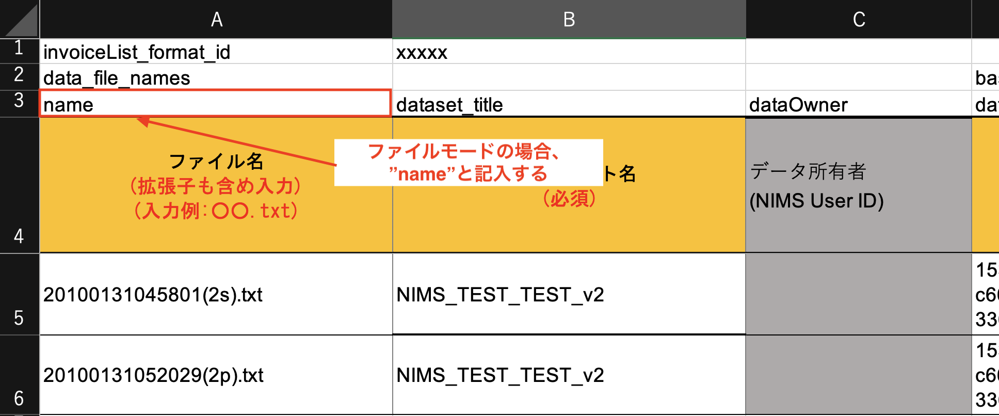
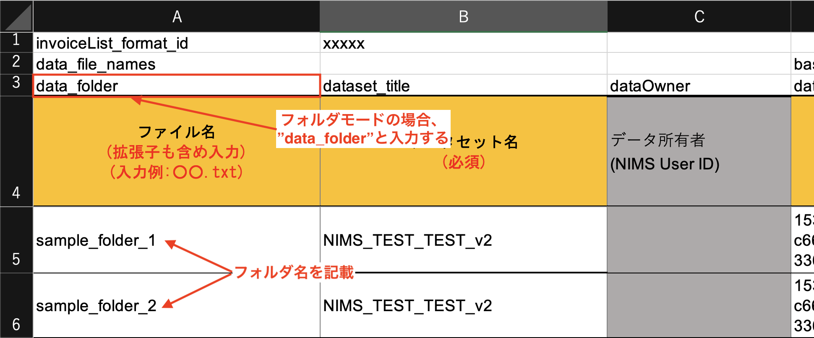

# 圧縮ファイルの形式について

Excelinvoiceモードでデータを登録するとき、RDEには**ファイルモード**と**フォルダモード**という概念があります。
このドキュメントでは、ファイルモードとフォルダモードの説明と、記述ルール、その他注意事項等についてまとめます。

## ファイルモード

Excelinvoiceのデータ列(A列)にファイル名を列挙し、記載したファイル名をデータセットに登録するモードのことを指します。

起動条件や制約は以下の通りです。

- 下図の、A列のように`data_file_names`の次の行に`name`と記載する。(デフォルト)
- ファイル名には、ファイル名を記載する。(zip内のファイルパスではない。)



この時の入力zipファイルの構成は以下の通りです。zipファイル名は仮の名称とします。
ファイルモードで入力するzipファイルには、ファイルが平置きで格納された状態で圧縮します。

```shell
input.zip/
|-- 20100131045801(2s).txt
|-- 20100131052029(2p).txt
```

## フォルダモード

Excelinvoiceのデータ列(A列)にフォルダ名を列挙し、記載したフォルダ配下のファイルをデータセットに登録するモードのことを指します。

このモードの利用想定は、Excelinvoiceを利用し、複数のファイルを一つのデータタイルに登録したい場合、このモードでデータ登録を行います。



この時の入力zipファイルの構成は以下の通りです。zipファイル名は仮の名称とします。
フォルダモードで入力するzipファイルには、フォルダが格納された状態で圧縮し登録します。このとき、フォルダが登録されるのではなく、フォルダ配下のファイルが登録されるため、あらかじめご注意ください。

```shell
input.zip/
|-- sample_folder_1/
|   |-- file1.txt
|   |-- file2.txt
|
|-- sample_folder_2/
|   |-- file3.txt
|   |-- file4.txt
```

## その他

### 表記したモードと圧縮ファイルの構成が異なる場合

Excelinvoiceに表記したモードと、入力するzipファイルの構成が異なる場合、エラーとなり処理を正しく実行できません。

### この処理について

この処理は、RdeToolKitで定義しています。該当ソースコードは以下のリポジトリのリンクを参照してください。

!!! Reference
    - [parse_compressedfile_mode - compressed_controller](../rdetoolkit/impl/compressed_controller.md/#parse_compressedfile_mode)
