# csv2graph Sample Gallery

This gallery lets you explore the main `csv2graph` options with real sample data. Reproduce the sample directory layout shown in each section and you can run the commands exactly as written.

Every sample's CSV file is available for direct download on this page. Pre-rendered images and helper scripts are included when they add context.

## Sample 1: Basic Overlay Only

This minimal example plots XRD intensity data and uses `--no-individual` so that only the overlay image is produced (pass `--individual` to force per-series images even on single-series CSVs).

### Data Overview

The dataset emulates XRD intensity measurements.

```bash
2theta (deg),Intensity (counts)
10.0,204.9671
10.02,198.6174
10.04,206.4769
10.06,215.2303
10.08,197.6585
10.1,197.6586
10.12,215.7921
10.14,207.6743
...
```

- [data.csv](./csv2graph_samples/sample1/data.csv)

=== "Generated Plot"
    { width="700" }

### Directory Layout

```bash
sample1/
|-- data.csv
|-- data.png
`-- sample.py
```

### How to Run

Switch between the Python script and CLI examples using the tabs below.

=== "Python"
    ```python
    # sample.py
    from pathlib import Path

    from rdetoolkit.graph import csv2graph

    if __name__ == "__main__":
        csv2graph(
            csv_path=Path("sample1/data.csv"),
            no_individual=True,  # --no-individual
        )
    ```

=== "CLI"
  ```bash
  rdetoolkit csv2graph 'sample1/data.csv' --no-individual
  ```

### Option Details

- `no_individual=True`, `--no-individual`: Skip individual plots and emit only the overlay image.

## Sample 2: Log-Scale Y Axis

This sample uses synthetic diode I-V data to show how `--logy` plots the Y axis on a logarithmic scale while setting a custom title.

### Data Overview

The dataset approximates the I-V characteristics of a diode.

```bash
Voltage (V),Current (A)
0.0,9.999999999999999e-19
0.0008008008008008008,1.735937164947776e-14
0.0016016016016016017,3.5020091083020285e-14
0.0024024024024024027,5.298738950880688e-14
0.0032032032032032033,7.095468793459339e-14
0.004004004004004004,8.891763700246374e-14
0.0048048048048048045,1.0684102478227538e-13
0.005605605605605606,1.2485910126202743e-13
...
```

- [data.csv](./csv2graph_samples/sample2/data.csv)

=== "Generated Plot"
{ width="700" }

### Directory Layout

```bash
sample2/
|-- data.csv
`-- sample_log_scale.py
```

### How to Run

Switch between the Python script and CLI examples using the tabs below.

=== "Python"
    ```python
    # sample_log_scale.py
    from pathlib import Path

    from rdetoolkit.graph import csv2graph

    if __name__ == "__main__":
        csv2graph(
            csv_path=Path("sample2/data.csv"),
            logy=True,
            title="I-V_Curve_of_a_Diode_(log scale)",
        )
    ```

=== "CLI"
    ```bash
    rdetoolkit csv2graph sample2/data.csv \
      --logy \
      --no-individual \
      --title "I-V_Curve_of_a_Diode_(log scale)"
    ```

### Option Details

- `no_individual=True`, `--no-individual`: Skip individual plots and emit only the overlay image.
- `--logy` / `logy=True`: Plot the Y axis on a logarithmic scale.

> The sample dataset does not cover logarithmic X axes, but you can enable it with `--logx` / `logx=True`.

## Sample 3: Axis Inversion (X/Y)

This example demonstrates `--invert-x` and `--invert-y` using XRD data.

### Data Overview

The dataset emulates XRD intensity measurements.

```bash
2theta (deg),Intensity (counts)
10.0,204.9671
10.02,198.6174
10.04,206.4769
10.06,215.2303
10.08,197.6585
10.1,197.6586
10.12,215.7921
10.14,207.6743
...
```

- [data.csv](./csv2graph_samples/sample3/data.csv)

=== "Generated Plot"
    { width="700" }

### Directory Layout

Before running the sample, the directory contains:

```bash
sample3/
|-- data.csv
`-- sample_invert.py
```

### Inverting the X Axis

Switch between the Python script and CLI examples using the tabs below.

=== "Python"
    ```python
    # sample_invert.py
    from pathlib import Path

    from rdetoolkit.graph import csv2graph

    if __name__ == "__main__":
        # invert_x
        csv2graph(
            csv_path=Path("sample3/data.csv"),
            invert_x=True,  # --invert-x
            no_individual=True,  # --no-individual
        )
    ```

=== "CLI"
    ```bash
    rdetoolkit csv2graph 'sample3/data.csv' --invert-x --no-individual
    ```

#### Inverting the Y Axis

=== "Python"
    ```python
    # sample_invert.py
    from pathlib import Path
    from rdetoolkit.graph import csv2graph

    if __name__ == "__main__":
        # invert_y
        csv2graph(
            csv_path=Path("sample3/data.csv"),
            invert_y=True,  # --invert-y
            no_individual=True,
        )
    ```

=== "CLI"
    ```bash
    rdetoolkit csv2graph 'sample3/data.csv' --invert-y --no-individual
    ```

### Option Details

- `invert_x=True`, `--invert-x`: Flip the overlay horizontally.
- `invert_y=True`, `--invert-y`: Flip the overlay vertically.
- `no_individual=True`: Skip individual plots and emit only the overlay image.

## Sample 4: Overlaying Multiple X/Y Pairs

This sample plots three joint torque signals by pairing multiple X and Y columns and exports both the overlay and per-series plots.

### Data Overview

Synthetic three-joint (J1-J3) angle/velocity/torque data generated from near-monotonic angles with a linear model plus small noise.

```bash
Phase-U:volt(V),Phase-U:curr(A),Phase-U:power(kW),Phase-V:volt(V),Phase-V:curr(A),Phase-V:power(kW),Phase-W:volt(V),Phase-W:curr(A),Phase-W:power(kW)
230.1,10.02,2.126,231.0,10.11,2.116,229.7,10.15,2.13
230.1,9.94,2.109,231.1,10.26,2.138,229.8,10.06,2.118
230.2,9.83,2.077,231.0,10.09,2.096,229.3,10.05,2.075
230.4,10.14,2.161,231.0,10.27,2.135,229.4,10.27,2.176
...
```

- [data.csv](./csv2graph_samples/sample4/data.csv)

=== "Generated Plot"
    { width="700" }

=== "Individual Plot 1"
    { width="700" }

=== "Individual Plot 2"
    { width="700" }

=== "Individual Plot 3"
    { width="700" }

### Directory Layout

Before running the sample, the directory contains:

```bash
sample4/
|-- data.csv
`-- sample_pair_plot.py
```

### How to Run

Switch between the Python script and CLI examples using the tabs below.

=== "Python"
    ```python
    # sample_pair_plot.py
    from pathlib import Path

    from rdetoolkit.graph import csv2graph

    if __name__ == "__main__":
        csv2graph(
            csv_path=Path("sample4/data.csv"),
            mode="overlay",
            x_col=[1, 4, 7],
            y_cols=[0, 3, 6],
            title="Angle-Dependent-Torque",
        )
    ```

=== "CLI"
    ```bash
    rdetoolkit csv2graph sample4/data.csv \
        --mode overlay \
        --x-col 1 --x-col 4 --x-col 7 \
        --y-cols 0 --y-cols 3 --y-cols 6 \
        --title "Angle-Dependent-Torque"
    ```

### Option Details

- `--mode overlay`: Overlay all series in a single figure (equivalent to the legacy x1y1x2y2 mode).
- `--x-col 1 --x-col 4 --x-col 7`: Specify three X columns (0-based indices 1, 4, 7). Each pairs with the corresponding Y column below.
- `--y-cols 0 --y-cols 3 --y-cols 6`: Specify the matching Y columns (indices 0, 3, 6) to form three series.
- `--title "Angle-Dependent Torque"`: Set the plot title and filename stem.

## Sample 5: One X Column with Many Y Series

This Raman spectroscopy example pairs one X column with multiple Y series and customises the plot title.

### Data Overview

Dummy Raman spectroscopy data. The horizontal axis is `Raman Shift (cm^-1)` and the Y series represent `Intensity (counts)` at positions `Pos0`-`Pos10`.

```bash
Raman Shift (cm^-1),Pos0: Intensity (counts),Pos1: Intensity (counts),Pos2: Intensity (counts),Pos3: Intensity (counts),Pos4: Intensity (counts),Pos5: Intensity (counts),Pos6: Intensity (counts),Pos7: Intensity (counts),Pos8: Intensity (counts),Pos9: Intensity (counts),Average: Intensity (counts)
100.0,117.0,124.0,134.0,135.0,111.0,126.0,132.0,116.0,126.0,114.0,124.0
101.551,117.0,126.0,106.0,138.0,110.0,127.0,134.0,146.0,134.0,116.0,125.0
103.102,126.0,139.0,110.0,150.0,119.0,134.0,128.0,128.0,116.0,141.0,129.0
104.652,100.0,108.0,90.0,119.0,118.0,145.0,106.0,117.0,144.0,117.0,116.0
106.203,102.0,87.0,114.0,125.0,117.0,108.0,112.0,117.0,133.0,136.0,115.0
...
```

- [data.csv](./csv2graph_samples/sample5/data.csv)

=== "Overlay Plot"
    { width="700" }

### Directory Layout

Before running the sample, the directory contains:

```bash
sample5/
|-- data.csv
`-- sample_custom_title.py
```

### How to Run

Switch between the Python script and CLI examples using the tabs below.

=== "Python"
    ```python
    # sample_custom_title.py
    from pathlib import Path

    from rdetoolkit.graph import csv2graph

    if __name__ == "__main__":
        csv2graph(
            csv_path=Path("sample5/data.csv"),
            mode="overlay",
            x_col=[1, 4, 7],
            y_cols=[0, 3, 6],
            title="Angle-Dependent-Torque",
        )
    ```

=== "CLI"
    ```bash
    rdetoolkit csv2graph sample5/data.csv \
      --x-col 0 \
      --y-cols 1 --y-cols 2 --y-cols 3 --y-cols 4 --y-cols 5 \
      --no-individual \
      --title "Angle-Dependent-Torque"
    ```

### Option Details

- `--x-col 0`: Use column 0 for the X axis. One declaration automatically pairs it with all specified Y columns.
- `--y-cols 1 ... 5`: Plot five Y series (columns 1-5).
- `--no-individual`: Output only the combined plot and skip individual PNGs.
- `--title`: Provide a custom plot title.

## Sample 6: Limiting Legend Entries

This Raman spectroscopy sample caps the number of legend items via `--max-legend-items`.

### Data Overview

Dummy Raman spectroscopy data with `Raman Shift (cm^-1)` on the X axis and `Intensity (counts)` for positions `Pos0`-`Pos10`.

```
Raman Shift (cm^-1),Pos0: Intensity (counts),Pos1: Intensity (counts),Pos2: Intensity (counts),Pos3: Intensity (counts),Pos4: Intensity (counts),Pos5: Intensity (counts),Pos6: Intensity (counts),Pos7: Intensity (counts),Pos8: Intensity (counts),Pos9: Intensity (counts),Average: Intensity (counts)
100.0,117.0,124.0,134.0,135.0,111.0,126.0,132.0,116.0,126.0,114.0,124.0
101.551,117.0,126.0,106.0,138.0,110.0,127.0,134.0,146.0,134.0,116.0,125.0
103.102,126.0,139.0,110.0,150.0,119.0,134.0,128.0,128.0,116.0,141.0,129.0
104.652,100.0,108.0,90.0,119.0,118.0,145.0,106.0,117.0,144.0,117.0,116.0
106.203,102.0,87.0,114.0,125.0,117.0,108.0,112.0,117.0,133.0,136.0,115.0
...
```

- [data.csv](./csv2graph_samples/sample6/data.csv)

=== "Generated Plot"
    { width="700" }

### Directory Layout

Before running the sample, the directory contains:

```bash
sample6/
|-- data.csv
`-- sample_max_legend_items.py
```

### How to Run

Switch between the Python script and CLI examples using the tabs below.

=== "Python"
    ```python
    # sample_max_legend_items.py
    from pathlib import Path

    from rdetoolkit.graph import csv2graph

    if __name__ == "__main__":
        csv2graph(
            "sample6/data.csv",
            x_col=0,
            y_cols=[1, 2, 3, 4, 5],
            no_individual=True,
            max_legend_items=3,
        )
    ```

=== "CLI"
    ```bash
    rdetoolkit csv2graph sample6/data.csv \
      --x-col 0 \
      --y-cols 1 --y-cols 2 --y-cols 3 --y-cols 4 --y-cols 5 \
      --no-individual \
      --max-legend-items 3
    ```

### Option Details

- `--x-col 0`: Use column 0 for the X axis so every declared Y column automatically pairs with it.
- `--y-cols ...`: Enumerate the five Y series (columns 1-5).
- `--no-individual`: Produce only the combined overlay PNG and skip per-series PNGs.
- `--max-legend-items 3`: Show at most three legend entries; remaining items are hidden to keep the plot readable.

## Sample 7: Multi-Channel Charge/Discharge Overlay

This advanced example colours series by state labels spread across multiple columns while redirecting the output directory.

> No pre-rendered images are bundled with this sample. Run the code to generate outputs.

### Data Overview

The dataset mimics multi-channel charge/discharge measurements.

```
state_ch1,time_ch1[s],step_index_ch1,current_ch1[A],capacity_ch1[mAh],voltage_ch1[V],state_ch2,time_ch2[s],step_index_ch2,current_ch2[A],capacity_ch2[mAh],voltage_ch2[V],state_ch3,time_ch3[s],step_index_ch3,current_ch3[A],capacity_ch3[mAh],voltage_ch3[V],state_ch4,time_ch4[s],step_index_ch4,current_ch4[A],capacity_ch4[mAh],voltage_ch4[V],state_ch5,time_ch5[s],step_index_ch5,current_ch5[A],capacity_ch5[mAh],voltage_ch5[V],state_ch6,time_ch6[s],step_index_ch6,current_ch6[A],capacity_ch6[mAh],voltage_ch6[V]
Charge,0.0,1,1.0248357076505616,0.0,3.1464269673816196,Discharge,0.0,1,-0.9246489863932321,0.0,3.26398992423171,Discharge,0.0,1,-0.9703987550711959,0.0,3.301646178292083,Discharge,0.0,1,-0.8373920481516945,0.0,3.2405780651132403,Discharge,0.0,1,-1.0452295606856536,0.0,3.289520156004168,Discharge,0.0,1,-1.1267131011336096,0.0,3.2782242976855556
Charge,2.0,1,0.9930867849414408,0.5693531709169787,3.1401720080365,Discharge,2.0,1,-0.9528697682537017,0.0,3.2612743372332664,Discharge,2.0,1,-1.079386898465995,0.0,3.3142719992060634,Discharge,2.0,1,-0.9061484473317185,0.0,3.2529616227280664,Discharge,2.0,1,-0.9533585647953902,0.0,3.2768224979535368,Discharge,2.0,1,-1.0899924167596289,0.0,3.27788892249149
...
```

- [data.csv](./csv2graph_samples/sample7/data.csv)

### How to Run

Switch between the Python script and CLI examples using the tabs below.

=== "Python"
    ```python
    from pathlib import Path

    from rdetoolkit.graph import csv2graph

    if __name__ == "__main__":
        csv2graph(
            Path("sample7/data.csv"),
            x_col=[1, 7, 13, 19, 25, 31],
            y_cols=[5, 11, 17, 23, 29, 35],
            direction_cols=[0, 6, 12, 18, 24, 30],
            max_legend_items=5,
            title="Charge_Rest_Discharge",
            output_dir=Path("./custom_output"),
        )
    ```

=== "CLI"
    ```bash
    rdetoolkit csv2graph sample7/data.csv \
      --x-col 1 --x-col 7 --x-col 13 --x-col 19 --x-col 25 --x-col 31 \
      --y-cols 5 --y-cols 11 --y-cols 17 --y-cols 23 --y-cols 29 --y-cols 35 \
      --direction-cols 0 --direction-cols 6 --direction-cols 12 \
      --direction-cols 18 --direction-cols 24 --direction-cols 30 \
      --logx --logy --max-legend-items 5 \
      --title "Charge_Rest_Discharge" \
      --output-dir ./custom_output
    ```

### Option Details

- `--output-dir ./custom_output`: Store generated PNG/HTML outputs in a custom folder instead of alongside the CSV.
- `--title "Charge_Rest_Discharge"`: Set the plot title and filename stem (for example, `Charge_Rest_Discharge.png`).
- `--mode overlay`: Overlay all series in a single figure, pairing each X column with the corresponding Y column.
- `--x-col 1` `--x-col 7 ... 43`: Enumerate the X-axis columns (0-based). Here there are six series using columns 1, 7, 13, 19, 25, and 31.
- `--y-cols 5 --y-cols 11 ... 47`: List the matching Y columns (5, 11, 17, 23, 29, 35) in the same order as the X columns.
- `--direction-cols 0`, `--direction-cols 6 ... 42`: Provide the state/phase columns that control colouring or segmentation per series. Supply as many direction columns as Y series.
- `--max-legend-items 5`: Limit the legend to five entries so that additional series are hidden automatically.

## Sample 8: Supplementary Legend Information

This sample appends extra metadata near the legend via `--legend-info` for Raman spectroscopy data.

### Data Overview

Dummy Raman spectroscopy data with `Raman Shift (cm^-1)` on the X axis and `Intensity (counts)` for `Pos0`-`Pos10`.

```
Raman Shift (cm^-1),Pos0: Intensity (counts),Pos1: Intensity (counts),Pos2: Intensity (counts),Pos3: Intensity (counts),Pos4: Intensity (counts),Pos5: Intensity (counts),Pos6: Intensity (counts),Pos7: Intensity (counts),Pos8: Intensity (counts),Pos9: Intensity (counts),Average: Intensity (counts)
100.0,117.0,124.0,134.0,135.0,111.0,126.0,132.0,116.0,126.0,114.0,124.0
101.551,117.0,126.0,106.0,138.0,110.0,127.0,134.0,146.0,134.0,116.0,125.0
103.102,126.0,139.0,110.0,150.0,119.0,134.0,128.0,128.0,116.0,141.0,129.0
104.652,100.0,108.0,90.0,119.0,118.0,145.0,106.0,117.0,144.0,117.0,116.0
106.203,102.0,87.0,114.0,125.0,117.0,108.0,112.0,117.0,133.0,136.0,115.0
...
```

- [data.csv](./csv2graph_samples/sample8/data.csv)

=== "Generated Plot"
    { width="700" }

### Directory Layout

Before running the sample, the directory contains:

```bash
sample8/
|-- data.csv
`-- sample_legend_info.py
```

### How to Run

=== "Python"
    ```python
    # sample_legend_info.py
    from pathlib import Path
    from rdetoolkit.graph import csv2graph

    if __name__ == "__main__":
        csv2graph(
            csv_path=Path("sample8/data.csv"),
            title="sample_legend_info",
            legend_info="Sample: Raman Map\nLaser: 532 nm",
            no_individual=True,
        )
    ```

=== "CLI"
    ```bash
    rdetoolkit csv2graph sample8/data.csv \
      --title "sample_legend_info" \
      --legend-info "Sample: Raman Map\nLaser: 532 nm" \
      --no-individual
    ```

### Option Details
- `legend_info`: Append arbitrary text near the legend (or in the upper right). Use `\n` to insert line breaks.
- `no_individual=True`: Generate only the overlay image and skip individual plots.

## Sample 9: Displaying Grid Lines

This XRD example enables grid lines with `--grid` to make peak locations easier to read.

### Data Overview

The dataset uses synthetic XRD intensity values.

```csv
2theta (deg),Intensity (counts)
10.0,204.9671
10.02,198.6174
...
```

- [data.csv](./csv2graph_samples/sample9/data.csv)

=== "Generated Plot"
    { width="700" }

### Directory Layout

Before running the sample, the directory contains:

```bash
sample9/
|-- cmd.md
|-- data.csv
`-- sample_grid.py
```

### How to Run

=== "Python"
    ```python
    # sample_grid.py
    from pathlib import Path
    from rdetoolkit.graph import csv2graph

    if __name__ == "__main__":
        csv2graph(
            csv_path=Path("sample9/data.csv"),
            grid=True,                # --grid
            no_individual=True,
        )
    ```

=== "CLI"
    ```bash
    rdetoolkit csv2graph sample9/data.csv \
      --grid \
      --no-individual
    ```

### Option Details

- `grid=True`, `--grid`: Draw horizontal and vertical grid lines to improve readability.
- `no_individual=True`: Skip individual plots and generate only the overlay image.

## Sample 10: Narrowing the Display Range (xlim/ylim)

This sample zooms in on peak regions by combining `--xlim` and `--ylim` with XRD data.

### Data Overview

The dataset reuses XRD intensity values and shows how to restrict the visible range.

```csv
2theta (deg),Intensity (counts)
10.0,204.9671
10.02,198.6174
...
```

- [data.csv](./csv2graph_samples/sample10/data.csv)

=== "Generated Plot"
    { width="700" }

### Directory Layout

Before running the sample, the directory contains:

```bash
sample10/
|-- cmd.md
|-- data.csv
`-- sample_lim.py
```

### How to Run

=== "Python"
    ```python
    # sample_lim.py
    from pathlib import Path
    from rdetoolkit.graph import csv2graph

    if __name__ == "__main__":
        csv2graph(
            csv_path=Path("sample10/data.csv"),
            xlim=(15, 30),     # --xlim 15 30
            ylim=(180, 240),   # --ylim 180 240
            no_individual=True,
        )
    ```

=== "CLI"
    ```bash
    rdetoolkit csv2graph sample10/data.csv \
      --xlim 15 30 \
      --ylim 180 240 \
      --no-individual
    ```

### Option Details

- `--xlim <min> <max>`, `xlim=(<min>, <max>)`: Restrict the X-axis range (same units as the CSV). The example displays only 2theta from 15 degrees to 30 degrees.
- `--ylim <min> <max>`, `ylim=(<min>, <max>)`: Restrict the Y-axis range (same units as the dataset). The example keeps intensities between 180 and 240 counts.
- `--no-individual`: Produce only the overlay image and skip individual plots.

Zooming the range helps inspect peaks in detail and hide noisy regions.

## Sample 11: Separating Overlay and Individual Outputs

This example saves the overlay image and individual series outputs in different directories via `--main-image-dir` and `--output-dir`.

### Data Overview

The dataset reuses synthetic XRD intensity data and demonstrates splitting output destinations.

```csv
2theta (deg),Intensity (counts)
10.0,204.9671
10.02,198.6174
...
```

- [data.csv](./csv2graph_samples/sample11/data.csv)

=== "Overlay Plot"
    { width="700" }

=== "Individual Plot"
    .png){ width="700" }

### Directory Layout

```bash
$ ls -l sample11/
total 472
-rw-r--r--@ 1 user  staff  44132 10 26 23:33 data.csv
-rw-r--r--@ 1 user  staff    290 10 27 12:46 switch_output_directory.py
```

### How to Run

=== "Python"
    ```python
    # sample11/switch_output_directory.py
    from pathlib import Path
    from rdetoolkit.graph import csv2graph

    if __name__ == "__main__":
        csv2graph(
            csv_path=Path("sample11/data.csv"),
            main_image_dir=Path("sample11/main_image"),   # --main-image-dir
            output_dir=Path("sample11/other_image"),      # --output-dir
        )
    ```

=== "CLI"
    ```bash
    rdetoolkit csv2graph sample11/data.csv \
      --main-image-dir sample11/main_image \
      --output-dir sample11/other_image
    ```

### Output Structure After Running

```bash
sample11/
|-- data.csv
|-- main_image # directory for the overlay image
|   `-- data.png
|-- other_image # directory for individual plots
|   `-- data_intensity_(counts).png
`-- switch_output_directory.py
```

### Option Details

- `--main-image-dir`: Choose where the overlay image is saved. By default it matches `--output-dir`.
- `--output-dir`: Choose where individual PNG and HTML outputs are saved. Without this option, outputs live next to the input CSV.

Separating the directories keeps report-ready overlays and detailed analysis plots organised.

## Sample 12: Generating Plotly HTML Outputs

This sample enables interactive Plotly HTML output with `--html`.

### Data Overview

Synthetic XRD intensity data used to demonstrate the Plotly export option.

```csv
2theta (deg),Intensity (counts)
10.0,204.9671
10.02,198.6174
...
```

- [data.csv](./csv2graph_samples/sample12/data.csv)

=== "Individual Plot"
    { width="700" }

### Directory Layout

```bash
sample12/
|-- data.csv
`-- output_html.py
```

### How to Run

=== "Python"
    ```python
    from pathlib import Path
    from rdetoolkit.graph import csv2graph

    if __name__ == "__main__":
        csv2graph(
            csv_path=Path("sample12/data.csv"),
            html=True,                 # --html
            output_dir=Path("plots"),
            no_individual=True,
        )
    ```

=== "CLI"
    ```bash
    rdetoolkit csv2graph sample12/data.csv \
      --output-dir plots \
      --html \
      --no-individual
    ```

### Directory After Execution

```bash
sample12/
|-- data.csv
|-- data.html # generated (HTML stays next to the CSV)
|-- output_html.py
`-- plots/
    `-- data.png # generated
```

### Option Details

- `--html`: Produce interactive Plotly HTML files (`*.html`). Open them in a browser to zoom and inspect traces.
- `--no-individual`: Skip per-series plots and keep only the combined output (the HTML stays next to the CSV by default unless you pass `--html-output-dir`).

Plotly output requires the Plotly library. If it is missing, you will see the following error message:

```bash
ImportError: Plotly is required for HTML output but is not installed. Install it with: pip install plotly
Unexpected error: Plotly is required for HTML output but is not installed. Install it with: pip install plotly
Aborted!
```

## Sample 14: Choosing a Legend Placement Policy (legend_policy)

This sample compares how each `legend_policy` value (`legacy` / `auto` / `inside` / `outside_right` / `outside_bottom` / `hide`) places the legend, using dummy data with 12 and 3 series. See the "Legend placement policy" section in [Visualizing CSV as Graphs](./csv2graph.en.md) for option details.

With `outside_right` / `outside_bottom`, the canvas is enlarged to fit the legend instead of shrinking the plot area, so the graph itself keeps its size even with many series.

### Data Overview

The sample uses `data.csv` (12 series) and `data_few.csv` (3 series). Both contain monotonically increasing dummy series.

```bash
x,series_01,series_02,series_03,series_04,series_05,series_06,series_07,series_08,series_09,series_10,series_11,series_12
0,0.0,0.4,1.0,1.5,1.9,2.4,3.0,3.5,4.0,4.5,5.0,5.5
1,0.6,1.2,1.6,2.1,2.6,3.1,3.6,4.1,4.6,5.1,5.7,6.1
...
```

- [data.csv](./csv2graph_samples/sample14/data.csv) (12 series)
- [data_few.csv](./csv2graph_samples/sample14/data_few.csv) (3 series)

### Preparation: Generating the Dummy Data

The CSV files can be downloaded from the links above. To generate them locally, run the script below (the published data and figures were generated with it).

=== "Python"
    ```python
    # make_data.py
    # Generate dummy CSV files for the legend_policy samples.
    # data.csv: 12 increasing series / data_few.csv: 3 increasing series
    from pathlib import Path

    import numpy as np

    BASE = Path(__file__).parent
    RNG = np.random.default_rng(42)


    def make_series_csv(path: Path, columns: list[str], offsets: list[float], slopes: list[float]) -> None:
        x = np.arange(11)
        header = ",".join(["x", *columns])
        lines = [header]
        for xi in x:
            values = [
                offset + slope * xi + RNG.normal(0, 0.05)
                for offset, slope in zip(offsets, slopes)
            ]
            lines.append(",".join([str(xi), *[f"{v:.1f}" for v in values]]))
        path.write_text("\n".join(lines) + "\n", encoding="utf-8")


    if __name__ == "__main__":
        make_series_csv(
            BASE / "data.csv",
            columns=[f"series_{i:02d}" for i in range(1, 13)],
            offsets=[0.5 * i for i in range(12)],
            slopes=[0.6] * 12,
        )
        make_series_csv(
            BASE / "data_few.csv",
            columns=["series_alpha", "series_beta", "series_gamma"],
            offsets=[0.0, 1.0, 2.0],
            slopes=[0.8, 0.8, 0.8],
        )
        print("generated: data.csv, data_few.csv")
    ```

=== "Command"
    ```bash
    python sample14/make_data.py
    ```

### Directory Layout

```bash
sample14/
|-- data.csv
|-- data_few.csv
|-- make_data.py
`-- sample_legend_policy.py
```

Running the bundled [sample_legend_policy.py](./csv2graph_samples/sample14/sample_legend_policy.py) generates the PNGs for all cases below at once. The following sections show how to run each case individually.

### Case 1: legacy (previous behavior)

This is the default when `legend_policy` is not specified. The legend is rendered inside the plot area and controlled by `legend_loc` and `max_legend_items` as before.

=== "Generated Plot"
    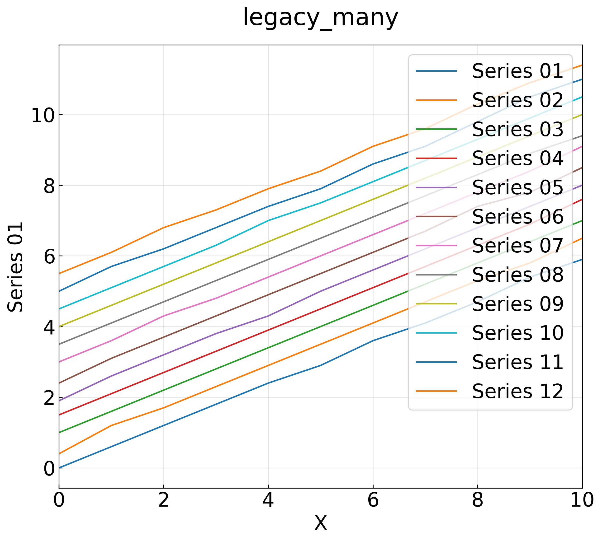{ width="700" }

=== "Python"
    ```python
    from pathlib import Path
    from rdetoolkit.graph import csv2graph

    if __name__ == "__main__":
        csv2graph(
            csv_path=Path("sample14/data.csv"),
            output_dir=Path("sample14"),
            x_col="x",
            no_individual=True,
            grid=True,
            title="legacy_many",
            legend_policy="legacy",
            legend_loc="upper right",
            max_legend_items=30,
        )
    ```

=== "CLI"
    ```bash
    rdetoolkit csv2graph sample14/data.csv \
      --output-dir sample14 \
      --x-col x \
      --no-individual --grid \
      --title legacy_many \
      --legend-policy legacy \
      --legend-loc "upper right" \
      --max-legend-items 30
    ```

### Case 2: auto with 3 series (kept inside)

`auto` picks the placement from the item count. Three series is at or below `legend_outside_threshold` (default 8), so the legend stays inside the plot area.

=== "Generated Plot"
    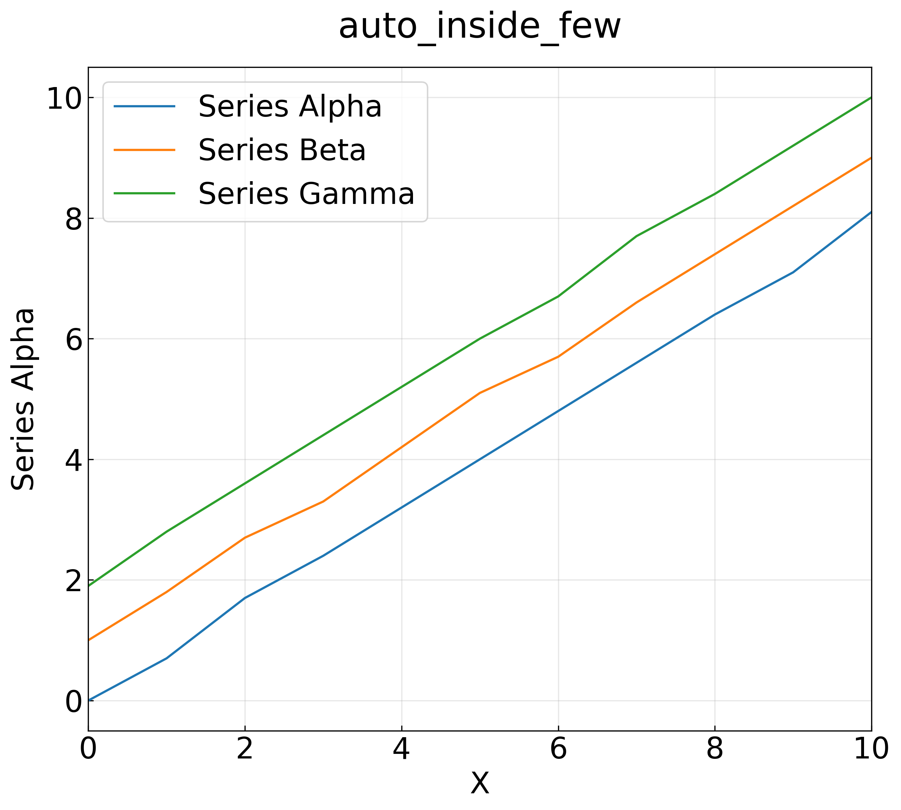{ width="700" }

=== "Python"
    ```python
    from pathlib import Path
    from rdetoolkit.graph import csv2graph

    if __name__ == "__main__":
        csv2graph(
            csv_path=Path("sample14/data_few.csv"),
            output_dir=Path("sample14"),
            x_col="x",
            no_individual=True,
            grid=True,
            title="auto_inside_few",
            legend_policy="auto",
            legend_outside_threshold=8,
            max_legend_items=20,
        )
    ```

=== "CLI"
    ```bash
    rdetoolkit csv2graph sample14/data_few.csv \
      --output-dir sample14 \
      --x-col x \
      --no-individual --grid \
      --title auto_inside_few \
      --legend-policy auto \
      --legend-outside-threshold 8 \
      --max-legend-items 20
    ```

### Case 3: auto with 12 series (switches to outside right)

Twelve series exceeds `legend_outside_threshold=8`, so `auto` moves the legend outside the plot on the right. The plot area keeps its size; the canvas grows to the right.

=== "Generated Plot"
    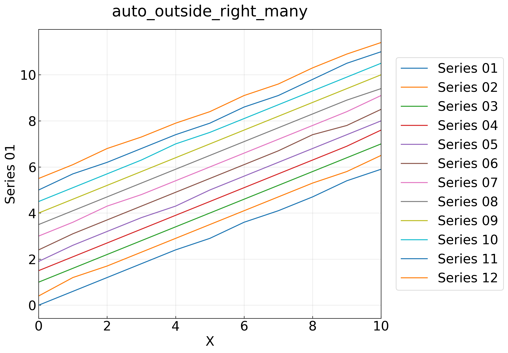{ width="700" }

=== "Python"
    ```python
    from pathlib import Path
    from rdetoolkit.graph import csv2graph

    if __name__ == "__main__":
        csv2graph(
            csv_path=Path("sample14/data.csv"),
            output_dir=Path("sample14"),
            x_col="x",
            no_individual=True,
            grid=True,
            title="auto_outside_right_many",
            legend_policy="auto",
            legend_outside_threshold=8,
            max_legend_items=30,
        )
    ```

=== "CLI"
    ```bash
    rdetoolkit csv2graph sample14/data.csv \
      --output-dir sample14 \
      --x-col x \
      --no-individual --grid \
      --title auto_outside_right_many \
      --legend-policy auto \
      --legend-outside-threshold 8 \
      --max-legend-items 30
    ```

### Case 4: Force outside_right

Places the legend outside the plot on the right regardless of the item count.

=== "Generated Plot"
    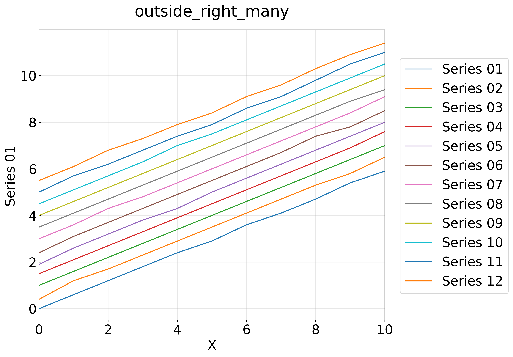{ width="700" }

=== "Python"
    ```python
    from pathlib import Path
    from rdetoolkit.graph import csv2graph

    if __name__ == "__main__":
        csv2graph(
            csv_path=Path("sample14/data.csv"),
            output_dir=Path("sample14"),
            x_col="x",
            no_individual=True,
            grid=True,
            title="outside_right_many",
            legend_policy="outside_right",
            max_legend_items=30,
        )
    ```

=== "CLI"
    ```bash
    rdetoolkit csv2graph sample14/data.csv \
      --output-dir sample14 \
      --x-col x \
      --no-individual --grid \
      --title outside_right_many \
      --legend-policy outside_right \
      --max-legend-items 30
    ```

### Case 5: outside_bottom with legend_ncol=4

Places the legend below the graph in 4 columns. The number of rows follows from the column count (12 items / 4 columns = 3 rows).

=== "Generated Plot"
    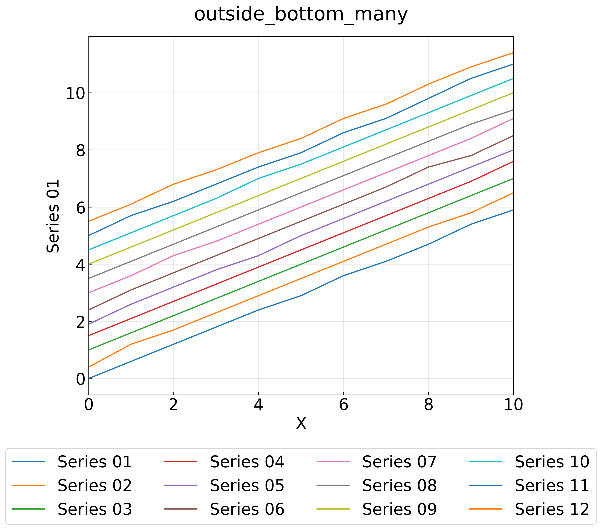{ width="700" }

=== "Python"
    ```python
    from pathlib import Path
    from rdetoolkit.graph import csv2graph

    if __name__ == "__main__":
        csv2graph(
            csv_path=Path("sample14/data.csv"),
            output_dir=Path("sample14"),
            x_col="x",
            no_individual=True,
            grid=True,
            title="outside_bottom_many",
            legend_policy="outside_bottom",
            legend_ncol=4,
            max_legend_items=30,
        )
    ```

=== "CLI"
    ```bash
    rdetoolkit csv2graph sample14/data.csv \
      --output-dir sample14 \
      --x-col x \
      --no-individual --grid \
      --title outside_bottom_many \
      --legend-policy outside_bottom \
      --legend-ncol 4 \
      --max-legend-items 30
    ```

### Case 6: hide (no legend)

=== "Generated Plot"
    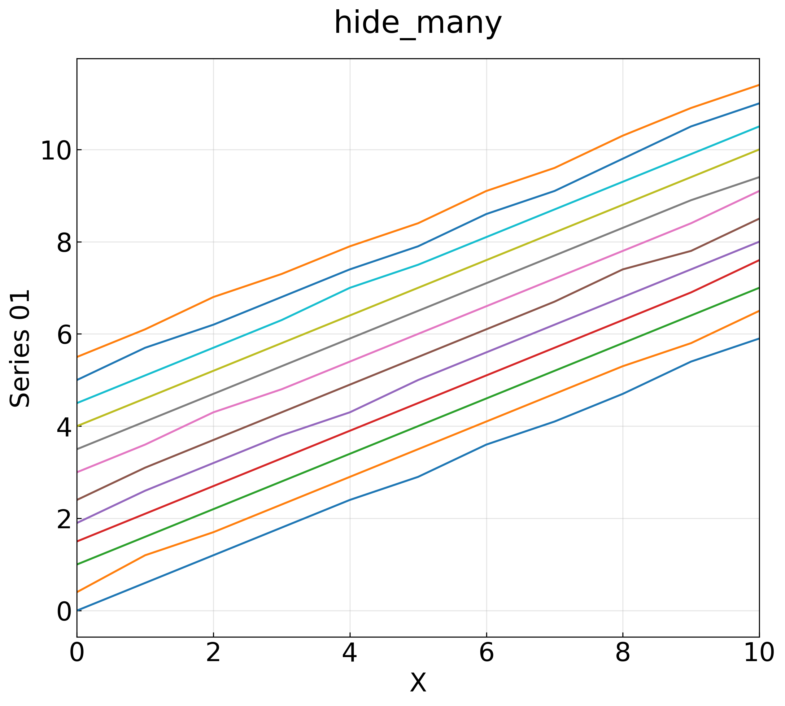{ width="700" }

=== "Python"
    ```python
    from pathlib import Path
    from rdetoolkit.graph import csv2graph

    if __name__ == "__main__":
        csv2graph(
            csv_path=Path("sample14/data.csv"),
            output_dir=Path("sample14"),
            x_col="x",
            no_individual=True,
            grid=True,
            title="hide_many",
            legend_policy="hide",
            max_legend_items=30,
        )
    ```

=== "CLI"
    ```bash
    rdetoolkit csv2graph sample14/data.csv \
      --output-dir sample14 \
      --x-col x \
      --no-individual --grid \
      --title hide_many \
      --legend-policy hide \
      --max-legend-items 30
    ```

### Case 7: auto exceeding max_legend_items (hidden automatically)

With `max_legend_items=5` and 12 series, `auto` hides the legend because the cap is exceeded.

=== "Generated Plot"
    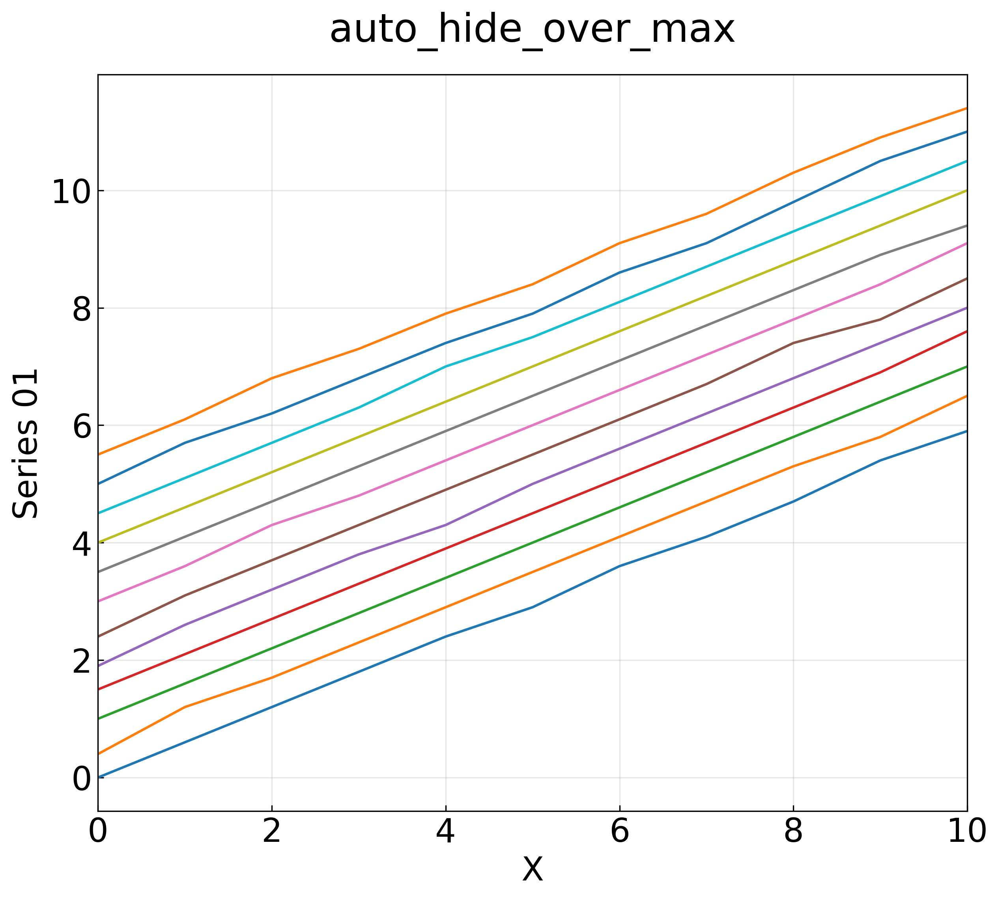{ width="700" }

=== "Python"
    ```python
    from pathlib import Path
    from rdetoolkit.graph import csv2graph

    if __name__ == "__main__":
        csv2graph(
            csv_path=Path("sample14/data.csv"),
            output_dir=Path("sample14"),
            x_col="x",
            no_individual=True,
            grid=True,
            title="auto_hide_over_max",
            legend_policy="auto",
            legend_outside_threshold=8,
            max_legend_items=5,
        )
    ```

=== "CLI"
    ```bash
    rdetoolkit csv2graph sample14/data.csv \
      --output-dir sample14 \
      --x-col x \
      --no-individual --grid \
      --title auto_hide_over_max \
      --legend-policy auto \
      --legend-outside-threshold 8 \
      --max-legend-items 5
    ```

### Option Details

- `legend_policy`, `--legend-policy`: Legend placement policy. Choose from `legacy` (default, previous behavior) / `auto` (chosen from the item count) / `inside` / `outside_right` / `outside_bottom` / `hide`.
- `legend_outside_threshold`, `--legend-outside-threshold`: Item-count threshold at which `auto` switches from inside to outside-right placement (default 8; switches when exceeded).
- `legend_ncol`, `--legend-ncol`: Number of legend columns for `outside_bottom` (3 when omitted).
- `max_legend_items`, `--max-legend-items`: Maximum number of legend items. The legend is hidden when exceeded (also applies to explicit non-`auto` policies).
- `x_col="x"`, `--x-col x`: Selects the X column by name. When `y_cols` is omitted, all remaining columns become Y series.

## Sample 15: Dense Legends with 30+ Series and Automatic Placement

This sample uses dummy data with 32 series to demonstrate legend control when there are very many legend items. With `legend_bottom_threshold` (default 21), `auto` automatically places the legend below the graph at 21 or more items.

In every case **the plot area keeps its size**; the canvas is enlarged to fit the legend, and the legend is never clipped in the saved PNG/SVG files.

### Data Overview

Straight-line data with 32 series. Each series is exactly `series_i(x) = i + 0.1 * x` (x = 0..10).

```bash
x,series_01,series_02,...,series_32
0,1.0,2.0,3.0,...,32.0
1,1.1,2.1,3.1,...,32.1
...
```

- [data.csv](./csv2graph_samples/sample15/data.csv) (32 series)

### Preparation: Generating the Dummy Data

The script below reproduces the published CSV exactly.

=== "Python"
    ```python
    # make_data.py
    # Generate a dummy CSV with 32 series for dense-legend samples.
    # Each series is a straight line: series_i(x) = i + 0.1 * x  (x = 0..10)
    from pathlib import Path

    BASE = Path(__file__).parent

    if __name__ == "__main__":
        columns = [f"series_{i:02d}" for i in range(1, 33)]
        lines = [",".join(["x", *columns])]
        for x in range(11):
            values = [i + 0.1 * x for i in range(1, 33)]
            lines.append(",".join([str(x), *[f"{v:.1f}" for v in values]]))
        (BASE / "data.csv").write_text("\n".join(lines) + "\n", encoding="utf-8")
        print("generated: data.csv")
    ```

=== "Command"
    ```bash
    python sample15/make_data.py
    ```

### Directory Layout

```bash
sample15/
|-- data.csv
|-- make_data.py
`-- sample_dense_legend.py
```

Running the bundled [sample_dense_legend.py](./csv2graph_samples/sample15/sample_dense_legend.py) generates the PNGs for all cases below at once.

### Case 1: Default auto behavior (21+ items go below the graph)

Thirty-two series is at or above the default `legend_bottom_threshold=21`, so `auto` places the legend below the graph. The column count defaults to 3; pass `legend_ncol=8` to compact it into 4 rows.

=== "Generated Plot (default ncol=3)"
    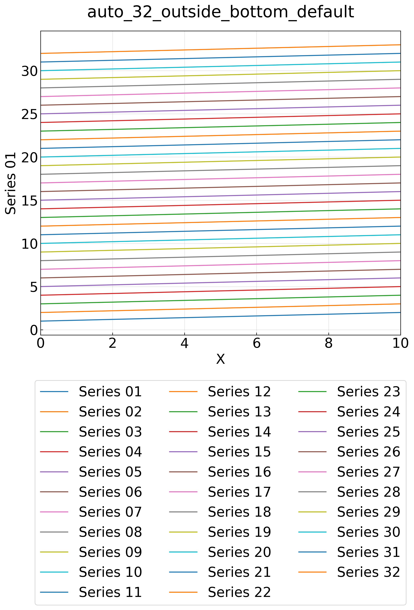{ width="700" }

=== "Generated Plot (legend_ncol=8)"
    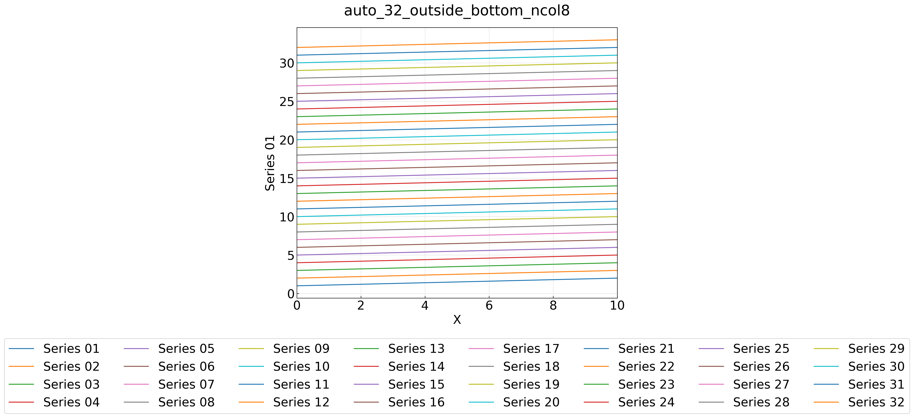{ width="700" }

=== "Python"
    ```python
    from pathlib import Path
    from rdetoolkit.graph import csv2graph

    if __name__ == "__main__":
        csv2graph(
            csv_path=Path("sample15/data.csv"),
            output_dir=Path("sample15"),
            x_col="x",
            no_individual=True,
            grid=True,
            title="auto_32_outside_bottom_default",
            legend_policy="auto",
            legend_outside_threshold=8,
            max_legend_items=40,
            # legend_ncol=8,  # for 8 columns (4 rows)
        )
    ```

=== "CLI"
    ```bash
    rdetoolkit csv2graph sample15/data.csv \
      --output-dir sample15 \
      --x-col x \
      --no-individual --grid \
      --title auto_32_outside_bottom_default \
      --legend-policy auto \
      --legend-outside-threshold 8 \
      --max-legend-items 40
      # --legend-bottom-threshold 21 is the default
    ```

### Case 2: Disable the bottom switch and keep the legend on the right

Passing `legend_bottom_threshold=None` (`--legend-bottom-threshold 0` on the CLI) disables the automatic switch to bottom placement, so the legend goes outside on the right as before. Even a tall 32-item legend is not clipped because the canvas also grows vertically.

=== "Generated Plot"
    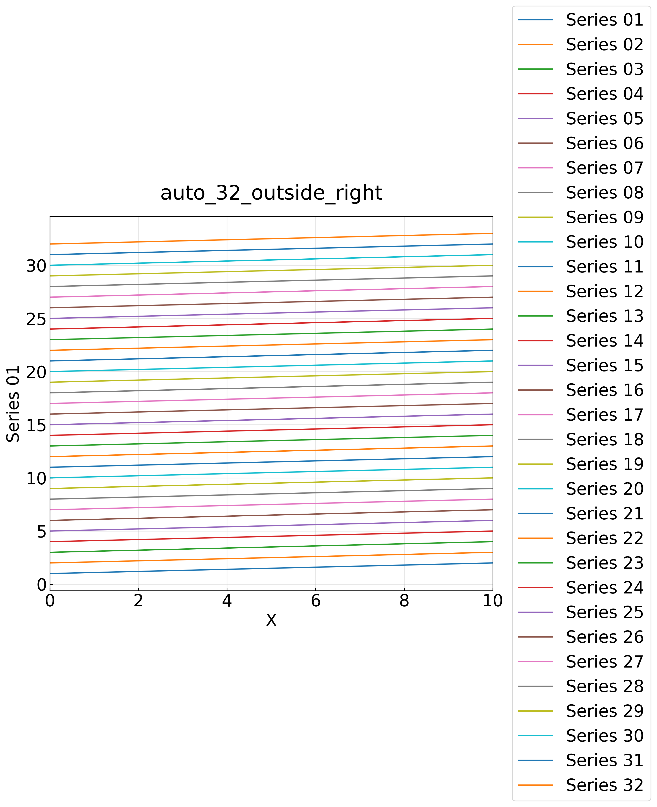{ width="700" }

=== "Python"
    ```python
    from pathlib import Path
    from rdetoolkit.graph import csv2graph

    if __name__ == "__main__":
        csv2graph(
            csv_path=Path("sample15/data.csv"),
            output_dir=Path("sample15"),
            x_col="x",
            no_individual=True,
            grid=True,
            title="auto_32_outside_right",
            legend_policy="auto",
            legend_outside_threshold=8,
            legend_bottom_threshold=None,
            max_legend_items=40,
        )
    ```

=== "CLI"
    ```bash
    rdetoolkit csv2graph sample15/data.csv \
      --output-dir sample15 \
      --x-col x \
      --no-individual --grid \
      --title auto_32_outside_right \
      --legend-policy auto \
      --legend-outside-threshold 8 \
      --legend-bottom-threshold 0 \
      --max-legend-items 40
    ```

### Case 3: Boundary behavior of legend_outside_threshold

The switch to outside-right happens when the item count **exceeds** the threshold. With 32 series, threshold 32 keeps the legend inside while threshold 31 moves it outside (the bottom switch is disabled for this check).

> The threshold-32 plot (legend kept inside) shows 32 items overflowing the plot area. It is included as a real example of why inside placement should not be used with many series.

=== "Threshold 32 (stays inside)"
    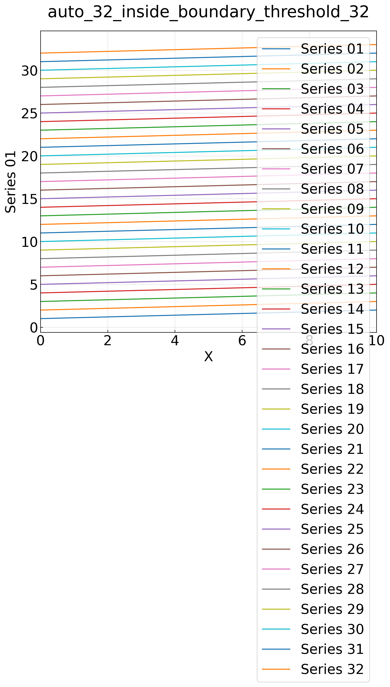{ width="700" }

=== "Threshold 31 (moves outside right)"
    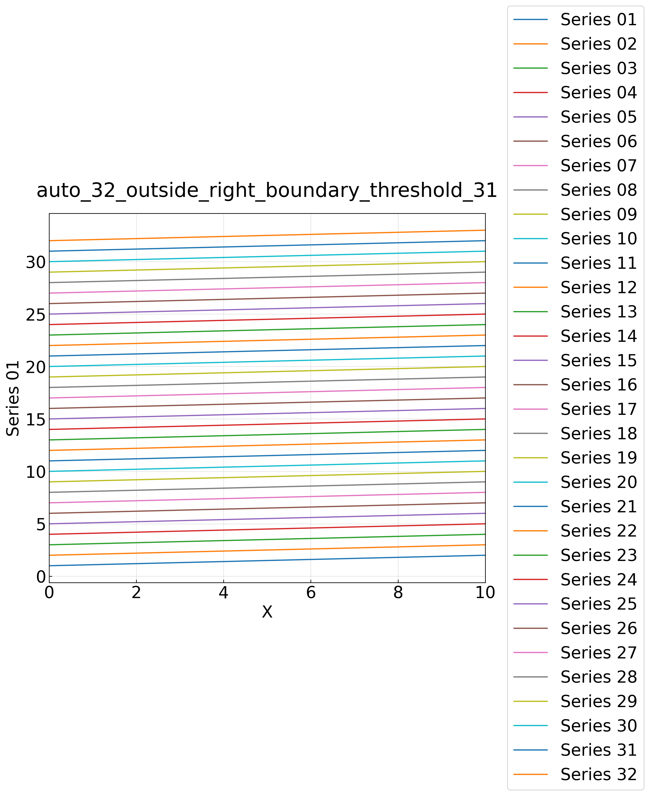{ width="700" }

=== "Python"
    ```python
    from pathlib import Path
    from rdetoolkit.graph import csv2graph

    if __name__ == "__main__":
        for threshold in (32, 31):
            csv2graph(
                csv_path=Path("sample15/data.csv"),
                output_dir=Path("sample15"),
                x_col="x",
                no_individual=True,
                grid=True,
                title=f"auto_32_boundary_threshold_{threshold}",
                legend_policy="auto",
                legend_outside_threshold=threshold,
                legend_bottom_threshold=None,
                max_legend_items=40,
            )
    ```

=== "CLI"
    ```bash
    rdetoolkit csv2graph sample15/data.csv \
      --output-dir sample15 \
      --x-col x \
      --no-individual --grid \
      --title auto_32_boundary_threshold_32 \
      --legend-policy auto \
      --legend-outside-threshold 32 \
      --legend-bottom-threshold 0 \
      --max-legend-items 40
    ```

### Case 4: Boundary behavior of legend_bottom_threshold

The switch to bottom placement happens **at or above** the threshold. With 32 series, threshold 32 places the legend below the graph while threshold 33 keeps it on the right.

=== "Threshold 32 (goes below)"
    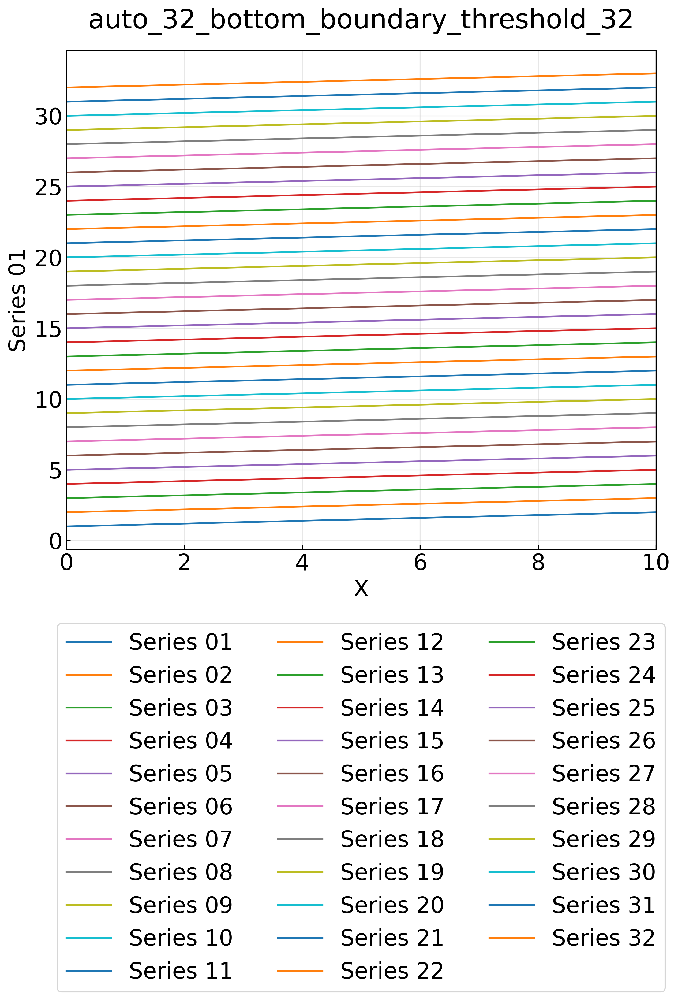{ width="700" }

=== "Threshold 33 (stays on the right)"
    { width="700" }

=== "Python"
    ```python
    from pathlib import Path
    from rdetoolkit.graph import csv2graph

    if __name__ == "__main__":
        for bottom_threshold in (32, 33):
            csv2graph(
                csv_path=Path("sample15/data.csv"),
                output_dir=Path("sample15"),
                x_col="x",
                no_individual=True,
                grid=True,
                title=f"auto_32_bottom_boundary_{bottom_threshold}",
                legend_policy="auto",
                legend_outside_threshold=8,
                legend_bottom_threshold=bottom_threshold,
                max_legend_items=40,
            )
    ```

=== "CLI"
    ```bash
    rdetoolkit csv2graph sample15/data.csv \
      --output-dir sample15 \
      --x-col x \
      --no-individual --grid \
      --title auto_32_bottom_boundary_32 \
      --legend-policy auto \
      --legend-outside-threshold 8 \
      --legend-bottom-threshold 32 \
      --max-legend-items 40
    ```

### Case 5: Forcing a placement (outside_right / outside_bottom)

These examples pin the placement explicitly instead of using `auto`. With `outside_bottom`, `legend_ncol` controls the number of columns (and therefore rows).

=== "outside_right"
    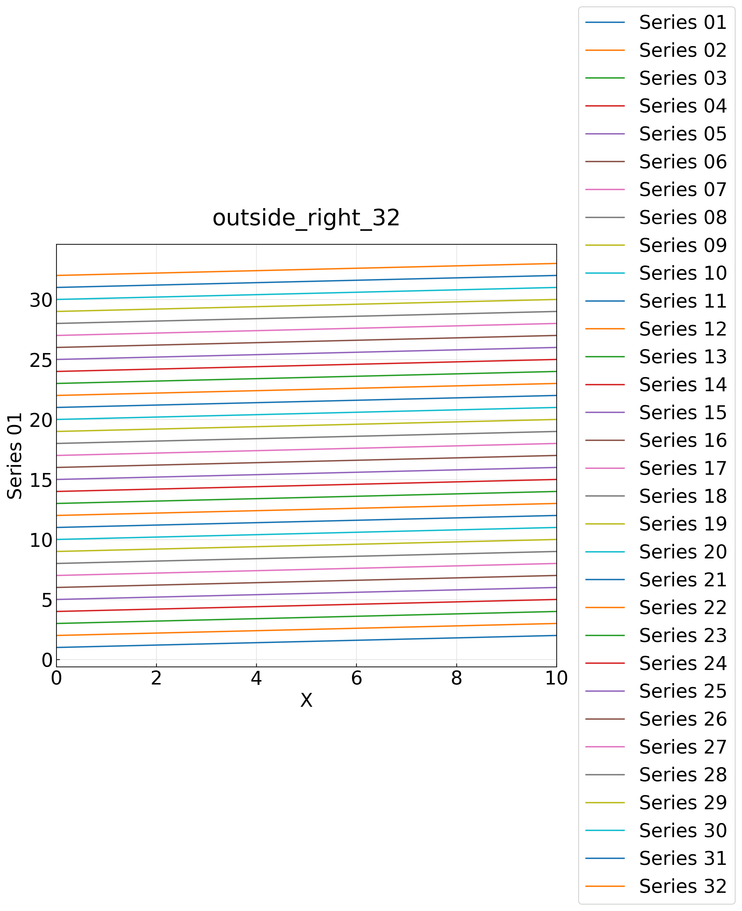{ width="700" }

=== "outside_bottom + ncol=8"
    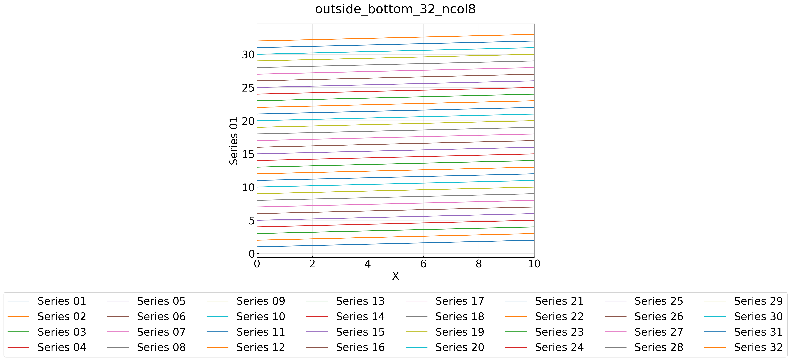{ width="700" }

=== "outside_bottom + ncol=4"
    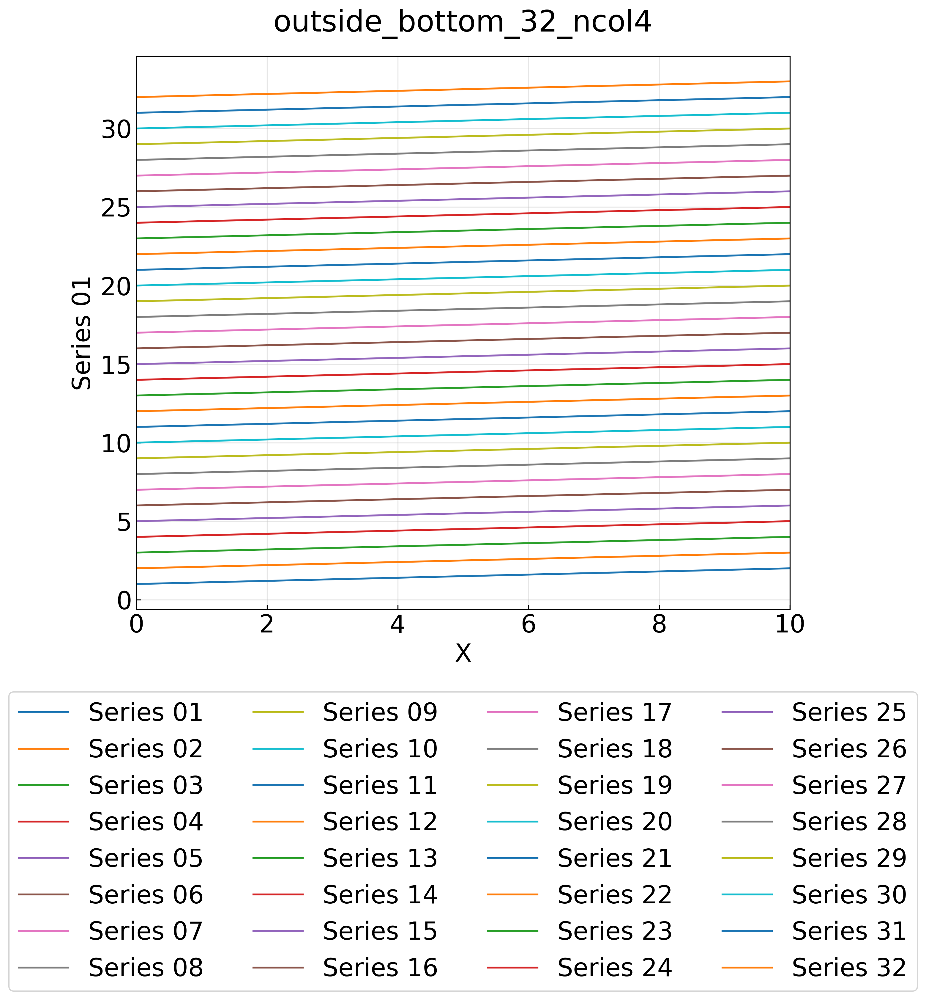{ width="700" }

=== "Python"
    ```python
    from pathlib import Path
    from rdetoolkit.graph import csv2graph

    if __name__ == "__main__":
        csv2graph(
            csv_path=Path("sample15/data.csv"),
            output_dir=Path("sample15"),
            x_col="x",
            no_individual=True,
            grid=True,
            title="outside_bottom_32_ncol8",
            legend_policy="outside_bottom",
            legend_ncol=8,
            max_legend_items=40,
        )
    ```

=== "CLI"
    ```bash
    rdetoolkit csv2graph sample15/data.csv \
      --output-dir sample15 \
      --x-col x \
      --no-individual --grid \
      --title outside_bottom_32_ncol8 \
      --legend-policy outside_bottom \
      --legend-ncol 8 \
      --max-legend-items 40
    ```

### Case 6: Hiding the legend (hide / exceeding max_legend_items)

An explicit `hide`, and an `auto` case where 32 series exceeds `max_legend_items=30` so the legend is hidden automatically. The output images are equivalent.

=== "Explicit hide"
    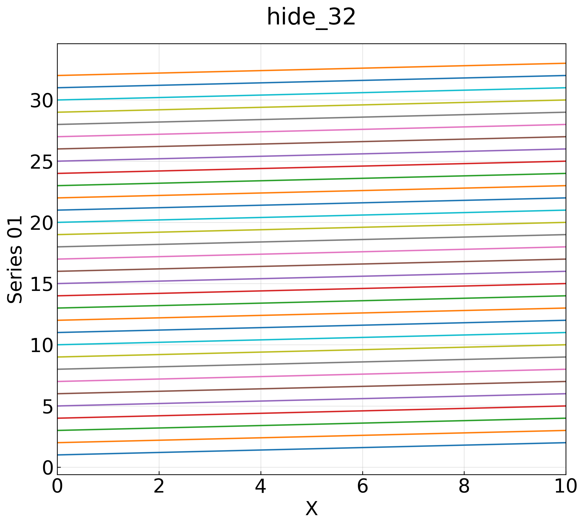{ width="700" }

=== "auto exceeding max_legend_items"
    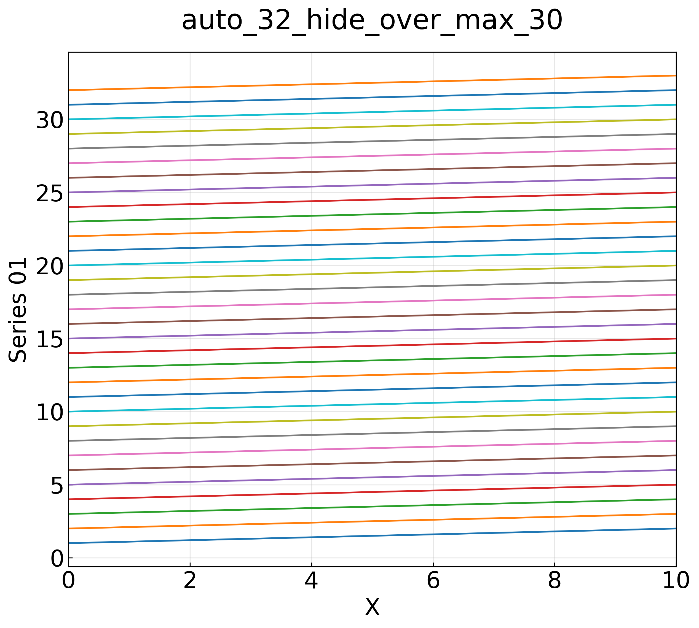{ width="700" }

=== "Python"
    ```python
    from pathlib import Path
    from rdetoolkit.graph import csv2graph

    if __name__ == "__main__":
        csv2graph(
            csv_path=Path("sample15/data.csv"),
            output_dir=Path("sample15"),
            x_col="x",
            no_individual=True,
            grid=True,
            title="hide_32",
            legend_policy="hide",
            max_legend_items=40,
        )
    ```

=== "CLI"
    ```bash
    rdetoolkit csv2graph sample15/data.csv \
      --output-dir sample15 \
      --x-col x \
      --no-individual --grid \
      --title hide_32 \
      --legend-policy hide \
      --max-legend-items 40
    ```

### Option Details

- `legend_bottom_threshold`, `--legend-bottom-threshold`: Item-count threshold at which `auto` switches to bottom placement (default 21; switches **at or above** this value). Pass `None` in Python or `0` or less on the CLI to disable.
- `legend_outside_threshold`, `--legend-outside-threshold`: Threshold at which `auto` switches to outside-right placement (switches when **exceeded**). With the defaults (8 / 21): 1-8 items stay inside, 9-20 items go outside right, and 21+ items go below the graph.
- `legend_ncol`, `--legend-ncol`: Number of columns for bottom placement. The row count follows from items / columns (32 items x 8 columns = 4 rows).
- With outside placements the canvas is enlarged while the plot area keeps its size, so the graph itself is never crushed no matter how many series there are.
