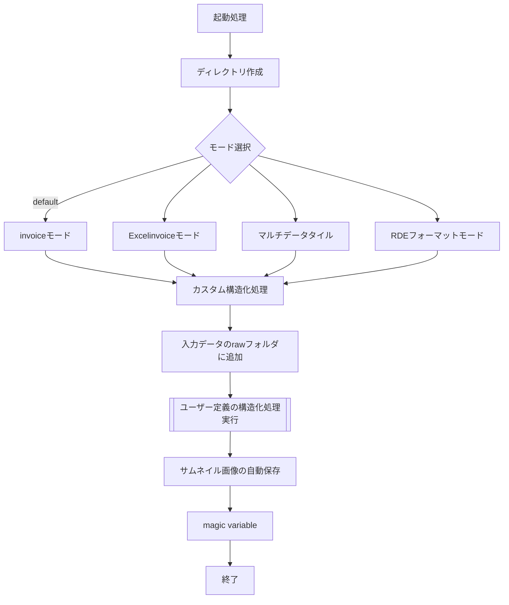
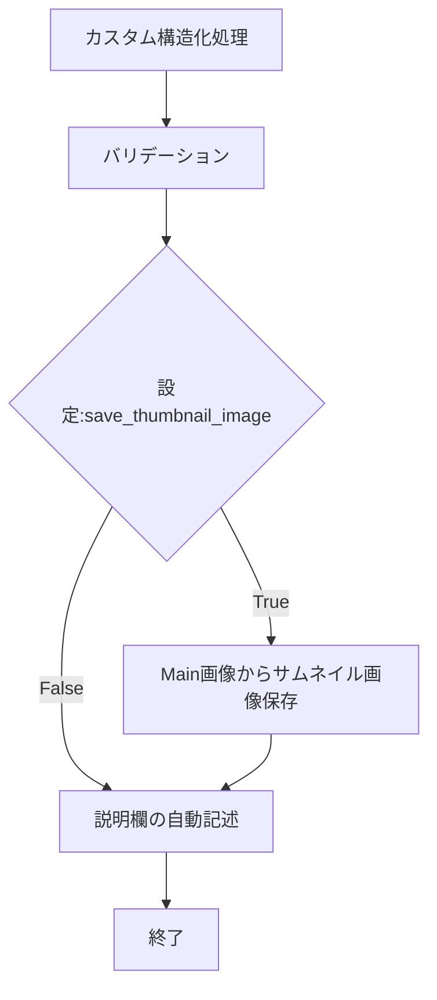

# 構造化処理を構築する

RDE構造化処理は、大きく分けて、以下の3つのフェーズに分けられます。


起動処理、終了処理は、rdetoolkitを使うことで簡単に実行できます。そのため、ユーザー自身は、ご自身のデータに対する処理を実行する`カスタム構造化処理`を定義するだけです。

## RDEToolKitがサポートする処理

- 起動モードの自動判定
- 入力データを指定したディレクトリに保存する
- Main画像をサムネイル画像に保存する
- magic variableの適用
- invoice.schema.json, invoice.json等のバリデーション
- metadata-def.jsonからデータセットタイルの説明欄自動生成

## 起動処理

起動処理では、カスタム構造化処理を実行する前の処理を実行します。

!!! Reference
    API Documents: [rdetoolkit.workflows.run](../../../rdetoolkit/workflows/#run)

### 実装例

実装は、プログラムのエントリーポイントとなるファイルに実装することを推奨します。例えば、`main.py`や`run.py`というファイルを作成し、以下のように実装します。

```python
from modules import process #独自で定義した構造化処理関数
import rdetoolkit

# run()がRDE構造化の起動処理と後処理を実行
rdetoolkit.workflows.run(custom_dataset_function=process.dataset)
```

### 具体的な処理について

起動処理は、次の処理を実行します。

- RDE構造化処理で必要なディレクトリの自動作成
- 入力ファイルを`raw`ディレクトリへ自動保存
- 入力ファイル・設定ファイルの内容から、各種モードに応じた読み込み処理
- 読み込んだファイルを、独自で定義したカスタム構造化処理に渡し実行

> 各種モードごとのファイル読み込みでは、ファイルの内容を読み込んでいません。そのため、ファイルに対する具体的な処理は、カスタム構造化処理等で定義してください。



## カスタム用構造化処理関数の作成

rdetoolkitでは、独自の処理をRDEの構造化処理のフローに組み込み込むことが可能です。独自の構造化処理は、入力データに対してデータ加工・グラフ化・機械学習用のcsvファイルの作成など、データセット固有の処理を定義することで、RDEへ柔軟にデータを登録可能です。

### 実装例

ここでは、rdetoolkitへ渡す独自データセット関数を、`dataset()`とします。`dataset()`は、以下の2つの引数を渡してください。

!!! Tip
    独自のクラス・関数群を定義する場合、必ず`RdeInputDirPaths`, `RdeOutputResourcePath`を引数で受け取り可能な関数でwrapしてください。

```python
# wrap用関数
def dataset(srcpaths: RdeInputDirPaths, resource_paths: RdeOutputResourcePath):
    # この関数内でユーザ自身が定義したクラスや関数を呼び出す
    ...
```

これの引数には、構造化するために必要な各種ディレクトリ情報やファイル情報が格納されています。特に、`RdeOutputResourcePath`には、ファイル保存先情報が格納されています。構造化処理内で上記のディレクトリ・ファイルパスを取得する方法は、[構造化ディレクトリパスの取得](rdepath.md)を参照してください。

- srcpaths (RdeInputDirPaths): 入力されたリソースファイルのパス情報
- resource_paths (RdeOutputResourcePath): 処理結果を保存するための出力リソースパス情報

!!! Reference
    - API Documentation: [RdeInputDirPaths - rde2types](../../../rdetoolkit/models/rde2types/#rdeinputdirpaths)
    - API Documentation: [RdeOutputResourcePath - rde2types](../../../rdetoolkit/models/rde2types/#rdeoutputresourcepath)

今回の例では、`modules`以下に、`display_messsage()`, `custom_graph()`, `custom_extract_metadata()`というダミー処理を定義し、独自の構造化処理を定義します。これらの関数は、`modules/process.py`というファイルを作成し定義します。以下の2つの引数を渡す関数でなければ、rdetoolkitは正しく処理が実行できません。

```python
# modules/process.py
def display_messsage(path):
    print(f"Test Message!: {path}")

def custom_graph():
    print("graph")

def custom_extract_metadata():
    print("extract metadata")

def dataset(srcpaths, resource_paths):
    display_messsage(srcpaths)
    display_messsage(resource_paths)
    custom_graph()
    custom_extract_metadata()
```

### 起動処理へ組み込む

この`dataset()`を起動するためには、先ほどの起動処理で作成したエントリーポイントとなるファイル(`main.py`など)に以下のように定義します。

```python
from modules import process #独自で定義した構造化処理関数
import rdetoolkit

# run()にカスタム構造化処理をを渡す
result = rdetoolkit.workflows.run(custom_dataset_function=process.dataset)
```

`result`には、構造化処理の実行ステータスが格納されます。

```shell
{
  "statuses": [
    {
      "run_id": "0000",
      "title": "test-dataset",
      "status": "success",
      "mode": "MultiDataTile",
      "error_code": null,
      "error_message": null,
      "target": "data/inputdata",
      "stacktrace": null
    },
    {
      "run_id": "0001",
      "title": "test-dataset",
      "status": "success",
      "mode": "MultiDataTile",
      "error_code": null,
      "error_message": null,
      "target": "data/inputdata",
      "stacktrace": null
    }
  ]
}
```

失敗した時の`result`の出力

```shell
{
  "statuses": [
    {
      "run_id": "0000",
      "title": "Structured Process Faild: MultiDataTile",
      "status": "failed",
      "mode": "MultiDataTile",
      "error_code": 999,
      "error_message": "Error: Error in modules",
      "target": "data/inputdata/sample1.txt",
      "stacktrace": "Traceback (most recent call last):\n  File \"/Users/myproject/.venv/lib/python3.10/site-packages/rdetoolkit/exceptions.py\", line 158, in skip_exception_context\n    yield error_info\n  File \"/Users/myproject/.venv/lib/python3.10/site-packages/rdetoolkit/workflows.py\", line 242, in run\n    status = multifile_mode_process(str(idx), srcpaths, rdeoutput_resource, custom_dataset_function)\n  File \"/Users/myproject/.venv/lib/python3.10/site-packages/rdetoolkit/modeproc.py\", line 157, in multifile_mode_process\n    datasets_process_function(srcpaths, resource_paths)\n  File \"/Users/myproject/modules/modules.py\", line 5, in error_modules\n    raise Exception(\"Error in modules\")\nException: Error in modules\n"
    },
    {
      "run_id": "0001",
      "title": "Structured Process Faild: MultiDataTile",
      "status": "failed",
      "mode": "MultiDataTile",
      "error_code": 999,
      "error_message": "Error: Error in modules",
      "target": "data/inputdata/sample2.txt",
      "stacktrace": "Traceback (most recent call last):\n  File \"/Users/myproject/.venv/lib/python3.10/site-packages/rdetoolkit/exceptions.py\", line 158, in skip_exception_context\n    yield error_info\n  File \"/Users/myproject/.venv/lib/python3.10/site-packages/rdetoolkit/workflows.py\", line 242, in run\n    status = multifile_mode_process(str(idx), srcpaths, rdeoutput_resource, custom_dataset_function)\n  File \"/Users/myproject/.venv/lib/python3.10/site-packages/rdetoolkit/modeproc.py\", line 157, in multifile_mode_process\n    datasets_process_function(srcpaths, resource_paths)\n  File \"/Users/myproject/modules/modules.py\", line 5, in error_modules\n    raise Exception(\"Error in modules\")\nException: Error in modules\n"
    }
  ]
}
```

## 終了処理について

続いて、`rdetoolkit.workflow.run()`が実行する終了処理について説明します。

- 生成ファイル、入力ファイルのバリデーション
- Main画像から代表画像の自動保存
- データタイル説明欄へ指定メタデータの自動記述



### 各種ファイルのバリデーション

バリデーションは、次のファイルが対象となります。これらのファイルは、データセット開設時、データ登録時に重要なファイルとなります。

- `tasksupport/metadata-def.json`
- `tasksupport/invoice.shcema.json`
- `data/invoice/invoice.json`

!!! Tips "Documents"
    [テンプレートファイルについて](../metadata_definition_file.md)

### 説明欄への自動転記

以下のドキュメントを参照してください。

- [データタイル説明欄への自動転記](./feature_description.md)
